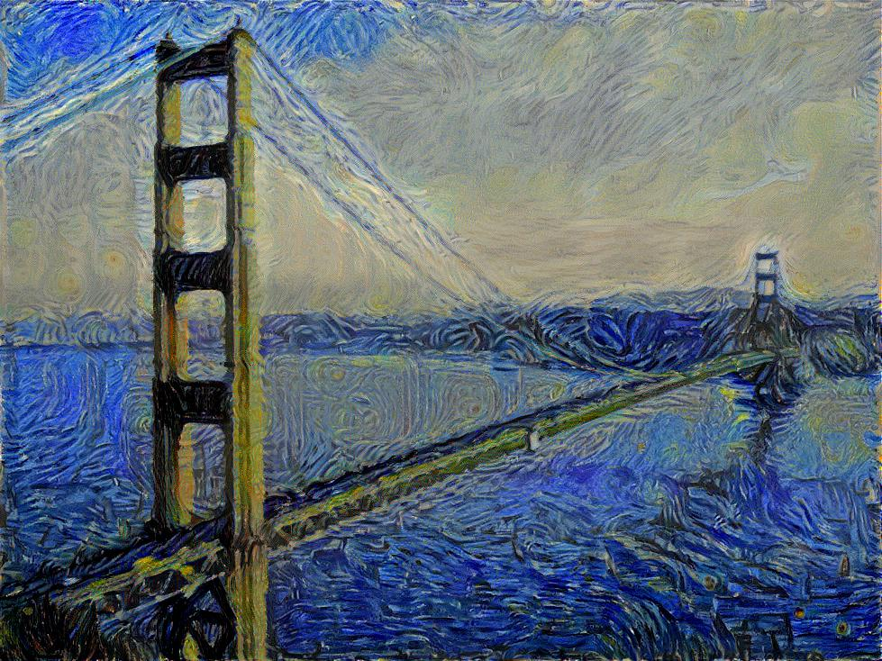

# tf-style-transfer

_This is a personal github repository. Don't share with others untill we are ready._ 

The project purposes are
 * implement the image style transfer methods (currently a slow sing-image converter and a real-time per-style converter) in tensorflow 
 * train per-style converters using diffrent style images on Amazon EC2
 * build tensorflow web services using trained per-style converters and lauch publicly

The a slow sing-image converter is coded in style_model.py. It converts a content image to a perticular art style based on the given style image.

### How to run

 1. check imported packeges in style_model.py
 2. download pretrained VGG16 nerual network file imagenet-vgg-verydeep-16.mat from http://www.vlfeat.org/matconvnet/pretrained/ and put under models folder
 3. change file locations at the top of style_model.py (optional)
 4. run python style_model.py using default content and style images or run python style_model.py --content content_img --style style_img

Default training finishes after 500 steps, which takes about 3 hours on mac pro cpu.

### First things you should do

 1. understand basics of github - branch, pull, push, commit, etc.; start dissussion, sharing and contributing with these tools
 2. understand basic concepts of convolutional neural networks http://cs231n.github.io/convolutional-networks/ 
 3. read tensorflow official tutorial and understand basic examples there

### Next steps

 1. Code the real-time per-style converter in tensorflow. I will finish in about 2-3 days.
 2. Move all traning to Amazon EC2 (with GPU). This task includes
  * research online what's the easist way to setup AWS GPU environment (install CUDA 7.5 and other things for tensorflow). There should be pre-set dockers/images online.
  * understand basics of tensorflow GPU/CPU and distributed training (check official tutorial)
  * modify the simple sing-image code and test on AWS to improve traning speed   

 WanZheng will start doing this and I will join after I finish writing the new model. Hopefully we can finish in about one week.
 
 3. tensorflow serving - build web services with tensorflow
  * use and understand google image classification tensorflow APIs
  * basics of docker - use kubernetes or something popular
  * build simple web service using tensorflow trained models on AWS (check official tutorial and research online)
 
 YanQing will focus on this and our target is to launch first version before end of Nov.

Please let me know if you have any questions. We will do regular meetings on a weekly basis. 
