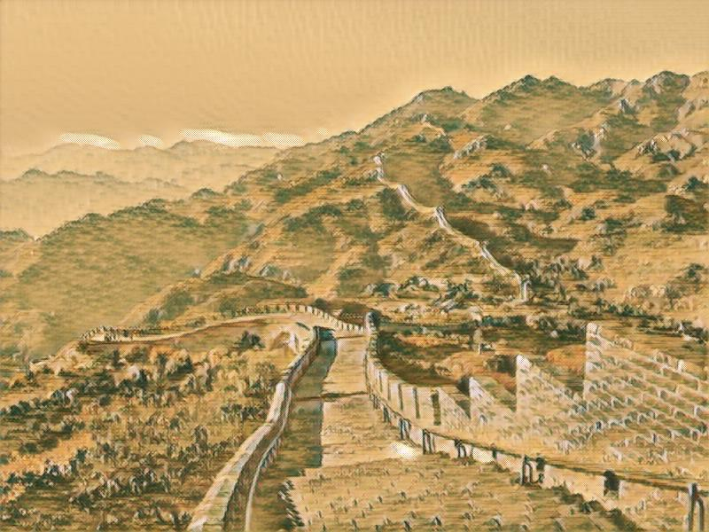
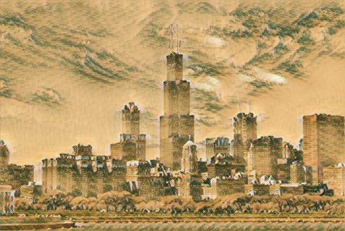

# tf-style-transfer

Tensorflow implementation of three style transfer methods.


#### Images to be transferred:
 <p align="center">


</p>

#### Style images:
 <p align="center">


</p>

### Methods:

 1. slow single image method: optimize each pixel value of an image to preserve content features from the original content image and style features from a style image
 
 [_Image Style Transfer Using Convolutional Neural Networks_](http://www.cv-foundation.org/openaccess/content_cvpr_2016/papers/Gatys_Image_Style_Transfer_CVPR_2016_paper.pdf)
 

 <p align="center">

</p>

 2. fast single style method: optimize an image transfer neural network for each style image to preserve similar content features and style features.
 
 [_Perceptual Losses for Real-Time Style Transfer and Super-Resolution_](https://arxiv.org/abs/1603.08155)
 
 <p align="center">


</p>

 <p align="center">


</p>
 
  <p align="center">


</p>

 3. fast general style method: train a general image transfer neural network with only normalization layers optimized for each style image to preserve similar content features and style features.
 
 [_A Learned Representation For Artistic Style_](https://arxiv.org/abs/1610.07629)

 <p align="center">


</p>

 <p align="center">



</p>
 
  <p align="center">



</p>

### How to run

 1. Install packeges tensorflow, numpy, scipy
 2. download pre-trained VGG16 neural network file imagenet-vgg-verydeep-16.mat from http://www.vlfeat.org/matconvnet/pretrained/ and put it under models folder
 3. for method 2&3, prepare a training set of content images (http://mscoco.org/dataset/#download) and resize all images to a standard size ([256, 256]).

#### To train a model:
For model 3, put all your style images under the same folder with name start with 's\_\*.jpg'.
```
python slow_single_image.py --content your_content_image --style your_style_image --vggfile downloaded_vgg_mat_file --max_iteration n
python fast_single_style.py --style your_style_image --train_dir training_image_dir --vggfile downloaded_vgg_mat_file --max_iteration n
python fast_general_style.py --style_dir your_style_image_dir --train_dir training_image_dir --vggfile downloaded_vgg_mat_file --max_iteration n
```

#### To stylize images:
Put all your images under the same folder with name start with 'c\_\*.jpg'.
```
python fast_single_style.py --stylize --content_dir your_content_image_dir
python fast_general_style.py --stylize --content_dir your_content_image_dir
```

### Reference:

* Torch version of the fast single style method from the author https://github.com/jcjohnson/fast-neural-style

* Google's official tensorflow implementation of the fast general style method https://github.com/tensorflow/magenta/tree/master/magenta/models/image_stylization
